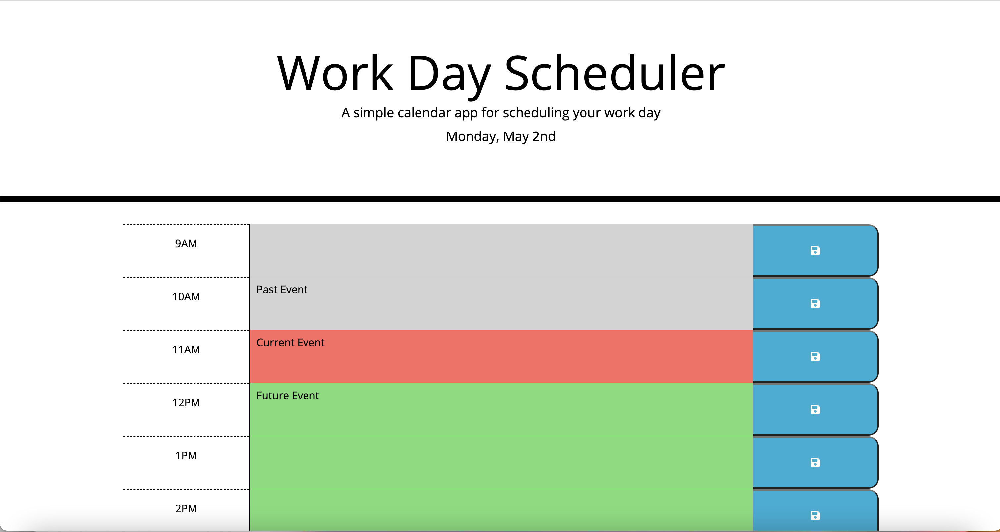

# Daily Planner
This is a simple daily planner app which shows what tasks have to be completed at what hour of the day. The time blocks in the past are represented with the color gray, current time block in red, and future time blocks in green. The colors are refreshed every second so the user does not have to refresh the whole page to check if their task is past due. The user can also change the tasks and click the save button on the right side to save it to the local storage. This allows users to see the same information they inputted even after refreshing the page.
 
## Links
* Github Repo - https://github.com/CodySawa/daily-planner
* Deployed Application - https://codysawa.github.io/daily-planner/

## Screenshot

